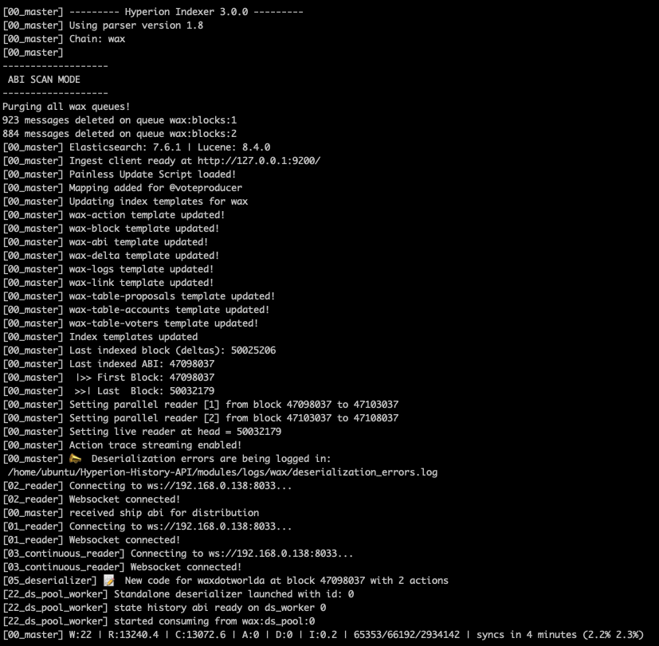

# Hyperion Set Up

### Clone & Install packages
```bash
git clone https://github.com/eosrio/hyperion-history-api.git
cd hyperion-history-api
npm install
```

!!! tip
    **if you came from the script section**, you can skip this step and go directly to the Edit configs step below.

<br>

## Set Up

TODO: Describe hyp-config tool.

### Initialize connections

First, let's initialize the connections configuration. Just run:

```
./hyp-config init connections
```

!!! note
    This command will also check the connection to Elasticsearch, Rabbitmq and Redis.

### Add new chain

Now you can proceed and add a new chain to your configuration. Run the following command:

```
./hyp-config new chain eos --http "http://127.0.0.1:8888" --ship "ws://127.0.0.1:8080"
```

### Check you configuration

Finally, check your configuration running:

```
/hyp-config list chains
```

## Plugins Set Up

!!! attention
    Under contruction

## Running Hyperion

We provide scripts to simplify the process of starting and stopping your Hyperion Indexer or API instance.

### Starting

To start, just use the run.sh script. Here are some examples:

!!! example "Examples"
    Starting indexer for EOS mainnet:
    ```
    ./run.sh eos-indexer
    ```
    Starting API for test chain:
    ```
    ./run.sh test-api
    ```

!!! note
    You need to pass the name of the chain you previously created followed by indexer or api to indicate the instance you want to start.

### Stopping

Use the stop.sh script to stop an instance as follows:

!!! example "Examples"
    Stop API for EOS mainnet:
    ```
    ./stop.sh eos-api
    ```
    Stop indexer for WAX mainnet:
    ```
    ./stop.sh wax-indexer
    ```

!!! note
    You need to pass the name of the chain you previously created followed by indexer or api to indicate the instance you want to stop.

!!! attention  
    The stop script won't stop Hyperion Indexer immediately, it will first flush the queues. Be aware that this operation could take some time.

## Indexer
As mentioned before on [Setup](#3-setup), the Hyperion Indexer is configured to perform an abi scan `("abi_scan_mode": true)` as default. So, on your first run, you'll probably see something like this:

 [](img/indexer.png)
 
This an example of an ABI SCAN on the WAX chain.

Where: 
    
  - W (Workers): Number of workers.
  - R (Read): Blocks read from state history and pushing into the blocks queue.
  - C (Consumed): Blocks consumed from blocks queue.
  - A (Actions): Actions being read out of processed blocks.
  - D (Deserialized): Deserializations of the actions.
  - I (Indexed): Indexing of all of the docs.


## API
After running the api, you should see a log like this:

 [](img/api.png)

Now, it's time to play around making some queries. :fontawesome-regular-laugh-beam:
