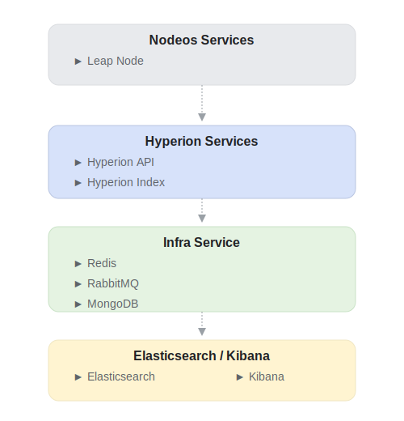
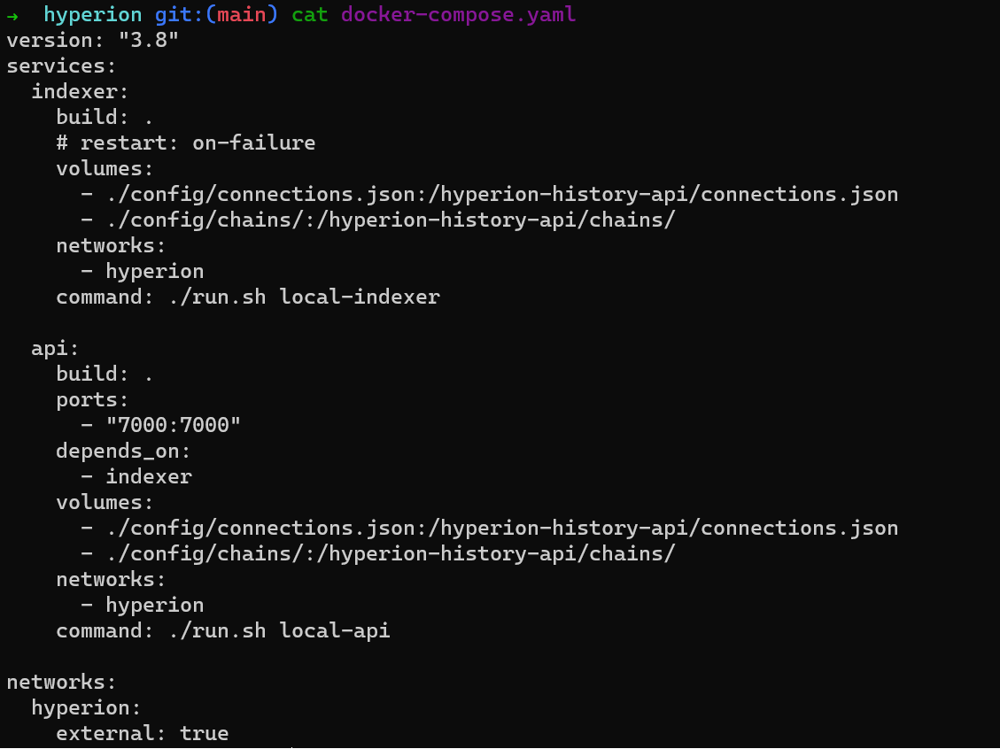
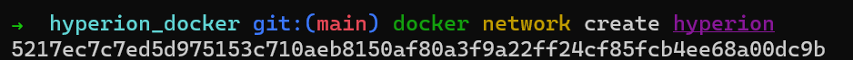

# Hyperion Docker
* [Hyperion Docker Repository](https://github.com/eosrio/hyperion-docker){:target="_blank"}

<br>

!!! warning
    Hyperion Docker is not recommended for production environments, only for testing, debugging and local networks.

Hyperion Docker is a multi-container Docker application intended to get Hyperion up and running as fast as possible. It will index data from a development chain where you can set your contracts, push some actions and see what happens when querying the Hyperion API.

!!! linux "Recommend OS"
    Ubuntu 22.04

## Architecture

### Layers

<!--  -->

To simplify things, we divided the microservices involved with Hyperion into layers.

1. Blockchain (Leap with state-history plugin)
2. Hyperion
3. Infra (Elasticsearch, Redis, RabbitMQ)

The **first layer** would be the Chain itself - `Node Service`. For Hyperion to work, we need a chain to consume data from. In this layer, we will have a single microservice:

!!! note "Leap Node"
    local chain for data consumption

The **second layer** would be Hyperion itself, which is divided into 2 microservices:

!!! note "Hyperion API"
    This service allows interaction with the indexed data.

!!! note "Hyperion Indexer"
    As its name suggests, this service connects to the Chain to fetch and index data.

And finally, in the **third layer**, which we can understand as `Infra Services`, there are 3 microservices:

1. Elasticsearch
2. Redis
3. RabbitMQ

** We added 2 extra microservices to facilitate debugging. These microservices need additional commands to be executed; see *[running extra tools section](#profile).

4. Kibana
5. RedisCommander

<a id='image-infrastructure'></a>
### Image Infrastructure

??? note "Infra Image"
    [](../../assets/img/infrastructure.svg)


Considering this structure, the [Project Repository](https://github.com/eosrio/hyperion-docker){:target="_blank"} has 3 folders representing each mentioned layer.

- ../hyperion-docker
    - hyperion
    - infra
    - nodeos


In each directory mentioned above, we added a `docker-compose.yaml` file that will be responsible for starting its respective microservices.

For those who have never used `docker-compose`, it allows the creation of several containers simultaneously. These containers are declared as services.

??? note "Example `docker-compose.yaml`"
    [](../../assets/img/docker-compose-file.png)

All services (containers) declared within a `docker-compose.yaml` share the same network by default. Still, as we will separate the containers into different files, we will need to create a network in Docker that will be shared. The procedure will be detailed below in the configuration process.


## Getting Started

### Prerequisites

Before starting with the containers, we need to make some Linux configurations to ensure we are fine with Elasticsearch. Edit the file `/etc/sysctl.conf`

``` bash
sudo nano /etc/sysctl.conf
```

Add the following properties:

``` bash
vm.overcommit_memory=1
vm.max_map_count=262144
```

To ensure the settings are working without restarting the machine, just run:

``` bash
sudo sysctl -w vm.overcommit_memory=1
sudo sysctl -w vm.max_map_count=262144
```

Now let's get started!

### Infrastructure Layer

#### 1. Clone the repository 

Clone the repository to your local machine:

``` bash
git clone https://github.com/eosrio/hyperion-docker.git
cd hyperion-docker
```

#### 2. Verify Docker is running 
Make sure Docker is running by executing the following command in the terminal:
``` bash
docker ps
```

!!! abstract "Expected result"
    

####  3. Create shared network

Create a network that will be shared between the containers by running the command:
``` bash
docker network create hyperion
```

!!! abstract "Expected result"
    


#### 4. Create the microservices

Now, let's start creating the microservices of the infrastructure layer. 

Navigate to the **infra directory** of the repository and run the following command:

``` bash
cd infra
docker compose up -d
```

!!! info "`-d` flag"
    Note that we use the `-d` flag to run in detached mode, allowing us to continue using the session's command line.

This command will create the 3 microservices (Elasticsearch, Redis, RabbitMQ).

The first time you run the command, it may take some time for everything to be set up. You can follow the execution log using the command:
``` bash
docker compose logs -f
```

Press ++ctrl+c++ to end the log reading process.

<a id='profile'></a>
#### 5. Running extra tools
Assuming that the 3 microservices are up and running, we added 2 extra microservices (Kibana and RedisCommander) to the docker-compose that can be executed with the following command:

``` bash
docker compose --profile tools up -d
```

These two microservices are responsible for the graphical interfaces interacting with Redis and Elasticsearch.

RedisCommander is a tool that allows you to view the data stored in Redis. It is useful for debugging and checking if the data is being stored correctly.

Kibana is a tool used to monitor your Elasticsearch cluster and view the data stored. It is useful for creating dashboards and graphs to visualize the data.

#### 6. Check services

Check if the services are up and running:

- RabbitMQ - [http://localhost:15672/](http://localhost:15672){:target="_blank"}

- Kibana - [http://localhost:5601/](http://localhost:5601){:target="_blank"}

- RedisCommander - [http://localhost:8089/](http://localhost:8089){:target="_blank"}


Once we have completed the Infrastructure Layer configuration, we can move on to the Leap (nodeos) Layer.

### Leap (nodeos) Layer

Navigate to the nodeos directory in the repository and run:

``` bash
cd ../nodeos
docker compose up -d
```
This layer was added to the repository assuming that you don't have a configured chain from which  the Hyperion Indexer will consume the data.

Once the infrastructure and the blockchain node are configured, we can finally start **Hyperion**.

### Hyperion Layer

This layer has 2 microservices, **Hyperion API** and **Hyperion Indexer**.

To start them, navigate to the hyperion directory and run the following command:

``` bash
cd ../hyperion
docker compose up -d
```

[//]: # (***Adicionar aqui um exemplo de interação com o HYPERION API.)


## Troubleshooting
If you're having problems accessing Kibana or using Elasticsearch API, you could disable the xpack security
on the docker-compose.yml setting it to false:

```
xpack.security.enabled=false
```

## Next steps

Feel free to change configurations as you like. All configurations files are located in `hyperion/config` or `nodeos/leap/config`. 

For more details, please refer to the [Hyperion Configuration Section :fontawesome-solid-arrow-right-long:](../setup/hyperion_configuration.md).

<br>
