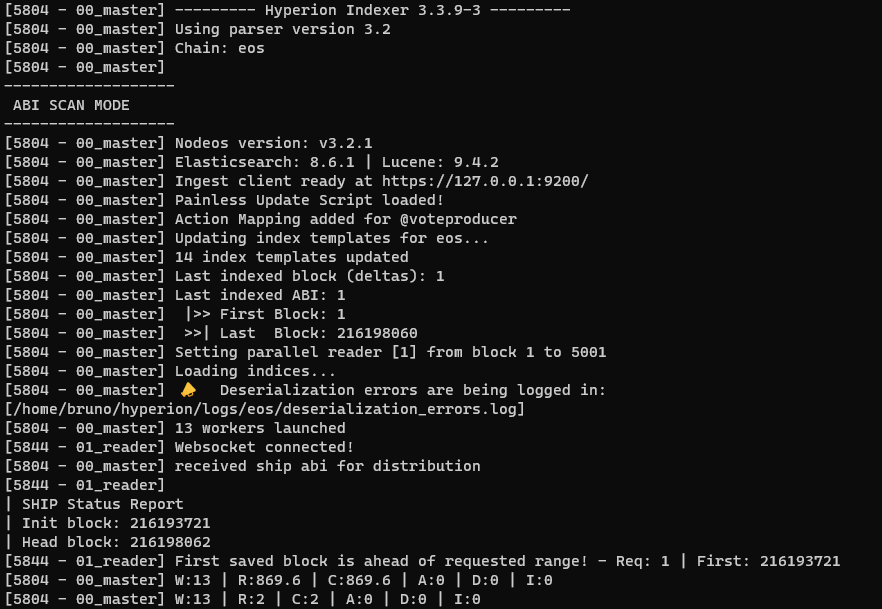

# Hyperion Configuration

We've developed a tool to automate the configuration of Hyperion. It initializes the connections with all the
dependencies and creates the configuration for each chain you are running.

!!! warning
    Make sure you are in the installation directory:
    ```shell
    cd ~/hyperion
    ```

!!! tip
    Run `./hyp-config --help` for more details.

### Initialize connections

First, let's initialize our configuration. Just run:

```
./hyp-config connections init
```

!!! note
    This command will also check the connection to Elasticsearch, Rabbitmq and Redis. Make sure everything is up and
    running.

You can use `./hyp-config connections test` to test connectivity at any point and `./hyp-config connections reset` to back up and remove the current configuration.

The initialization command will create a `connections.json` file that follows the template described [here](connections.md).

### Add new chain

Now you can proceed and add a new chain to your configuration. Run the following command:

```
./hyp-config new chain eos --http "http://127.0.0.1:8888" --ship "ws://127.0.0.1:8080"
```

This command will create a `chains/eos.config.json` file that follows the template described [here](chain.md) and also configure the state history section of the `connections.json` file for this chain.

### Check your chain configuration

Finally, check your configuration running:

```
./hyp-config list chains
```

You should see an output similar to:

[](../../assets/img/configured_chains.png)

## Running Hyperion

We provide scripts to simplify the process of starting and stopping your Hyperion Indexer or API instance.

### Starting

To run the indexer, execute `./run.sh [chain name]-indexer`

To run the api, execute `./run.sh [chain name]-api`

!!! example "Examples"
    Starting indexer for **"eos"** chain:
    ```
    ./run.sh eos-indexer
    ```
    Starting API for **"test"** chain:
    ```
    ./run.sh test-api
    ```

!!! note
    You need to pass the name of the chain you previously created followed by indexer or api to indicate the instance
    you want to start.

### Stopping

Use the stop.sh script to stop an instance as follows:

!!! example "Examples"
    Stop API for EOS mainnet:
    ```
    ./stop.sh eos-api
    ```
    Stop indexer for WAX mainnet:
    ```
    ./stop.sh wax-indexer
    ```

!!! note
    You need to pass the name of the chain you previously created followed by indexer or api to indicate the instance
    you want to stop.

!!! attention  
    The stop script won't stop Hyperion Indexer immediately, it will first flush the queues. Be aware that this
    operation could take some time.

## Indexer
The Hyperion Indexer is configured to perform an abi scan `("abi_scan_mode": true)` as default. So, on your first run,
you'll probably see something like this:

[](../../assets/img/indexer.png)

This an example of an ABI SCAN on the WAX chain.

Where:

  - W (Workers): Number of workers.
  - R (Read): Blocks read from state history and pushing into the blocks queue.
  - C (Consumed): Blocks consumed from blocks queue.
  - A (Actions): Actions being read out of processed blocks.
  - D (Deserialized): Deserializations of the actions.
  - I (Indexed): Indexing of all of the docs.


## API
After running the api, you should see a log like this:

 [](../../assets/img/api.png)

Now, it's time to play around making some queries. :fontawesome-regular-face-laugh-wink:

!!! tip "Tip"
    we are using `jq` to format the json output for better readability

    if you don't have it installed use

    ```
    sudo apt install jq
    ```

First, let's test the health check endpoint

```
curl -Ss "http://127.0.0.1:7000/v2/health" | jq
```

??? example "View example"
    [](../../assets/img/healthcheck.png)

Then we can ask for the last action on chain:

```
curl -Ss "http://127.0.0.1:7000/v2/history/get_actions?limit=1" | jq
```

??? example "View example"
    [](../../assets/img/get_actions.png)

We can do the same for deltas:

```
curl -Ss "http://127.0.0.1:7000/v2/history/get_deltas?limit=1" | jq
```

??? example "View example"
    [](../../assets/img/get_deltas.png)

You can check the **Swagger UI** at: `http://127.0.0.1:7000/v2/docs` for more information on all the available endpoints

## Enabling Streaming

Once your indexer is finished and it's only reading live blocks, you can enable the **streaming api** if needed. To do so, enable all options under `features.streaming` in your chain config file

```
"features": {
    "streaming": {
      "enable": true,
      "traces": true,
      "deltas": true
    }
```

By default, the stream api will be available on the `port 1234`, this can be configured by the `api.stream_port property` in the chain config file.

Once you're done configuring, just **restart** both the **indexer and api**.

A quick test using `curl 127.0.0.1:1234/stream/` should result in the output `{"code":0,"message":"Transport unknown"}` meaning the port is ready for websocket connections.
Alternatively, you can check the api logs after restart for a `Websocket manager loaded!` message

!!! note "NGINX"
    if you are using `NGINX` as your reverse proxy, use the following block to properly forward your `/stream` path to the correct port
    
    ```
    location /stream/ {
    proxy_set_header X-Forwarded-For $proxy_add_x_forwarded_for;
    proxy_set_header Host $host;
    proxy_pass http://127.0.0.1:1234/stream/;
    proxy_http_version 1.1;
    proxy_set_header Upgrade $http_upgrade;
    proxy_set_header Connection "upgrade";
    }
    ```

!!! tip "Tip"
    check our Proxy Guide for full `NGINX` or `HAProxy` examples.

Finally, clients using the Hyperion Stream Client will be able to connect https://github.com/eosrio/hyperion-stream-client

## Plugins Set Up

Plugins are optional. Follow the documentation on the required plugin page.

Official Plugins:

- [Hyperion Explorer](https://github.com/eosrio/hyperion-explorer-plugin/tree/develop)

!!! warning "Experimental Feature"
Running 3rd-party plugins could be dangerous, please make sure you review the published code before installing
